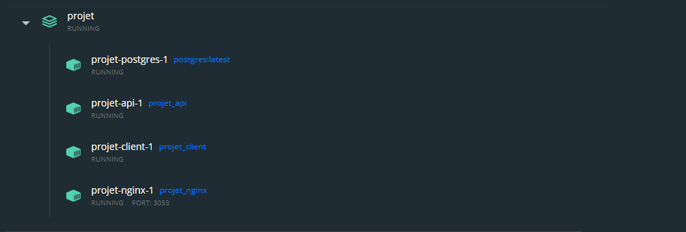

# TP Projet Docker

### Description du projet :  

Le projet consiste à faire comuniquer 4 container dans un environement Docker.
Pour faire cela j'ai choisi un projet de test en début de développement.
Il s'agit d'une application type le bon coin mais pour les camions.

Pour lancer le projet : ``docker-compose up --build``

Puis dirigez-vous vers : ``http://localhost:3053/``

 

Cette aplication a besoin :

- d'un front ***React*** 
- d'un back api ***NodeJs*** 
- et une base ***postgres*** avec qui comuniquer.

 

Pour réaliser à bien cela, pour gérer plusieurs connection en même temps je me suis aidé de ***NGINX***. J'ai ainsi pu gérer les différents paramètres de proxy, port et path pour mon api.

  

J'ai ainsi deux volumes.

- Un volume server pour mon Api.
- Un volume client pour mon front.

Dans ces deux volumes on peux y retrouver un dockerfile permettant l'installation du node-module et le lancement du projet.

J'utilise l'image postgres sur laquelle dépend mon api pour fonctionner.
Ainsi c'est mon api qui va fournir toutes les variables d'environnement nécessaire à la connexion à ma base de données postgre.

Avec ***NGINX*** je définis le path api, qui sera utilisé par le front ***React*** pour la comunication client-server.

J'ai ainsi bien 4 containers comuniquant entre eux.

  

Dans mon docker-compose.yml je définis ainsi toutes les bonnes dépendances entre mes containers.

Je définis avec ***NGINX*** le port 3053 sur lequel l'ensemble seras disponible.

